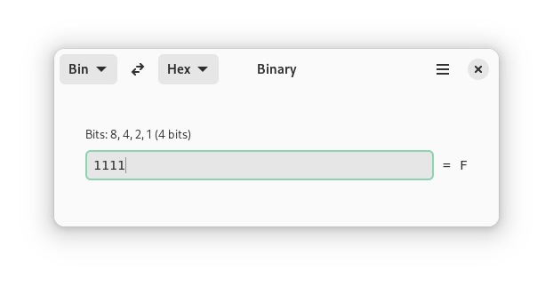

# Binary

[](https://hosted.weblate.org/engage/binary/)
[](https://github.com/fizzyizzy05/binary/actions/workflows/ci.yml)



Binary is a simple app for GNOME to easily convert between different number bases. 
## Installing
[](https://flathub.org/apps/io.github.fizzyizzy05.binary)

Binary is officially available as a flatpak on Flathub. 

## Features
- Calculations occur as you type
- Convert between binary, decimal and hexadecimal values
- The input box removes invalid digits when they're entered
- Bit counter for binary values

## Translations
Binary uses [Weblate](https://hosted.weblate.org/projects/binary/binary-app/) for translations.

For automatically creating a .pot file everytime a new string is added, use update_translations.sh. This script was adapted from [Letterpress](https://gitlab.gnome.org/World/Letterpress/-/tree/main) by Gregor Niehl, who in turn adapted it from TheEvilSkeleton.
  
## Testing/building
GNOME Builder is the recommended way to build and test this app.
### Using GNOME Builder:
1. Install GNOME Builder from Flathub
2. Clone this repository
```https://github.com/fizzyizzy05/binary.git```
3. Open this project in GNOME Builder and work on it from there.

## Code of Conduct
Binary is designed for GNOME, and built with GNOME technologies. As such, it follows the [GNOME Code of Conduct](https://wiki.gnome.org/Foundation/CodeOfConduct)

